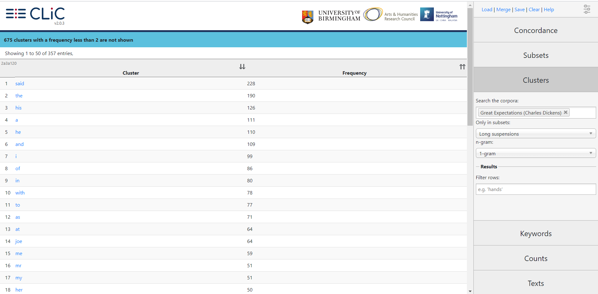

# Project Overview
I propose to conduct a corpus stylistic study of quotative suspensions in a carefully curated collection of novels by African American authors from roughly 1892-1912 using a web app called Corpus Linguistics in Context, or CLiC, developed by the University of Birmingham’s Centre for Corpus Research. This period of American history is known as the Nadir, or low point, of relations between white Americans and recently emancipated black Americans - a time characterized by rampant racial tensions and violence culminating in the lynching of hundreds of black Americans throughout the country. The traditional literary canon of this time period is dominated largely by white authors, and popular conceptions of the black experience and speech patterns are influenced by these authors such as Mark Twain in *The Adventures of Huckleberry Finn*, or Kate Chopin in "Desiree’s Baby." In the past few decades, though, American English departments have begun to rediscover several significant black literary voices of this period which had been marginalized by the passing of time, such as Charles Chesnutt, Sutton Griggs, Frances Harper, and Paul Laurence Dunbar. These authors and others like them give us a way to decolonize, so to speak, the traditional literary canon of this time period. The goal of my proposed stylistic study is to continue this mission of decolonization by centering the linguistic stylistics of these black literary authors, and to come to a better understanding of their linguistic and literary patterns in a way that only a computational approach can allow for.

# Quotative Suspensions
I model the goals and methodology of this project on [a 2018 study](https://www.birmingham.ac.uk/Documents/college-artslaw/elal/clic/Mahlberg-Wiegand-2018-accepted.pdf) conducted by Michaela Mahlberg and Viola Wiegand, two of the primary spearheads of the CLiC project at Birmingham, in which they examine “suspensions” in Charles Dickens’ *Great Expectations*. They define suspensions as “narratorial disruptions of character speech … which tend to contain reporting clauses and/or additional character information such as body language.” They give the following examples of suspensions from *Great Expectations* (GE):

1. >“Yes, Pip,” said Joe; “and what’s worse, she’s got Tickler with her.” (Chapter 2)
2. > “You know, Pip,” said Joe, solemnly, with his last bite in his cheek and speaking in a confidential voice, as if we two were quite alone, “you and me is always friends, and I’d be the last to tell upon you, any time. But such a--” he moved his chair and looked about the floor between us, and then again at me - “such a most oncommon Bolt as that!” (Chapter 2)

One of Mahlberg’s and Wiegand’s primary arguments is that even though suspensions are technically “narration,” which is to say they are not character speech, they display tendencies that are more similar to character speech than other instances of narration do. In other words, they carry a kind of residue of the speech patterns of whatever character they pertain to even though they are not actually being spoken by that character. 

It is quite obvious, though, that one of the above examples of suspension is much more illuminative and useful for this kind of study than the other. Example (1) only tells us who the speaker is, whereas Example (2) gives us quite a lot of detail about how he is speaking, what he is doing while he is speaking, and even speculates on what he might be thinking while he is speaking. If we want to study suspensions across an entire novel, then, let alone across several novels, we have to be able to efficiently parse and categorize them so we know which ones are useful and which ones are not. This is one of the many ways that the CLiC web app would make this study possible.

# Corpus Linguistics in Context (CLiC)

The above is an image of CLiC’s normal, default display of *Great Expectations* - a straightforward rendering of the entire novel. For our purposes, though, we want to comb through the novel for useful, meaningful suspensions. As we can see in the bottom-right of the image, CLiC allows us to highlight certain “subsets” of the text, including suspensions. It divides them into short suspensions, which are four words or fewer, and long suspensions, which are five words or greater. With a simple click, then, we can highlight suspensions that will be useful to our study, long ones such as Example (2) above, without including those that are too short to be of use, like Example (1):

CLiC also performs quantification and comparison functions, such as side-by-side word counts across the entire corpus of Dickens texts that have been uploaded to the app:

The Dickens corpus, called DNov, is one of four corpora that are loaded onto the CLiC app, and any text in any of the corpora can be compared in this way to any other of those texts or any other of those corpora as a whole.

Besides simple word counts, the CLiC app can also display the frequency with which words or word clusters occur in these texts or corpora, and in the subsets therein. For example, we can easily find which word occurs most frequently within long suspensions in *Great Expectations* by clicking on “Clusters” on the right side of the display and selecting the “Long suspension” subset:

As we can see, “said” is, unsurprisingly, the most common single word that occurs in long suspensions in *Great Expectations*. The frequencies of single words, or 1-grams, are hardly interesting or illuminative to us here, though. We can also find the most common clusters of more than one word by increasing the n value in the “n-gram” drop bar on the right side of the display (a 2-gram is a cluster of two words, a 3-gram is three words, etc.). 

These and the several other analytical functions that CLiC performs would greatly streamline the methodology and flow of this project. Unfortunately, there is a major obstacle that will take some time and some doing to overcome. The app can only deal with texts that are already uploaded to it, and only the developers of the app at the University of Birmingham have the authority to upload texts. If a user wishes to work with a text, much less an entire corpus of texts, that is not yet loaded to the app, they must be in direct contact with the developers, follow their instructions on re-formatting the text file to be compatible with the app’s interface, and give some explanation of how they intend to use the app. With the lack of expendable time and resources on Birmingham’s end, this process could take anywhere from a few weeks to a few months to complete.

# Study of Suspensions Without CLiC
To find out how worthwhile that process would be, I undertook a brief analysis of suspensions in one of the novels in my proposed corpus without the help of the CLiC app. The novel, *The House Behind the Cedars* by Charles Chesnutt published in 1900, is the story of a young mixed-race woman, Rena Walden, as she leaves her mother and hometown for the first time and tries to pass as white. To analyze the novel in the way that CLiC would, I first downloaded it as a plain text file from the [Project Gutenberg website](https://www.gutenberg.org/). Using the search and replace function in Notepad++, I isolated all of the quotes in the novel and put them in a separate text file. I then further refined the search and replace process on that file to isolate the suspensions, and refined it even further to isolate the long suspensions (five words or more) into their own text file:

I then ran some Python scripts on that file to determine things like word count and n-gram frequencies:

While the text manipulations in Notepad++ were not difficult or complex, they were quite tedious and took about an hour to complete. As a very inexperienced programmer, writing the Python scripts was quite a difficult task. Many hours and many forum searches later, I was able to produce the same analysis that the CLiC app would have produced in seconds at the touch of a button, not to mention that it would have done so in a much more readable and screenshot-able interface. Remember also that this is for only one of the several novels that I propose working with for this project. 

# Conclusion
If I am allowed the time and space to get these texts uploaded to the CLiC app, I would be able to produce much more precise, visually appealing analyses on a much more efficient timeline, and be able to make use of the several other analytical functions that CLiC offers beyond word counts and n-gram frequencies. Making use of the app in this way would also represent a contribution to the mission of Birmingham’s Centre for Corpus Research by opening up these texts to the public, allowing others to run different kinds of analyses on them and produce new kinds of studies about them.

# References
Mahlberg, M., & Wiegand, V. (2018). Corpus stylistics, norms and comparisons: Studying speech in *Great
Expectations*. In R. Page, B. Busse, & N. Nørgaard (Eds.), *Rethinking Language, Text and Context: Interdisciplinary
Research in Stylistics in Honour of Michael Toolan* (pp. 123–143). London: Routledge.
https://www.birmingham.ac.uk/Documents/college-artslaw/elal/clic/Mahlberg-Wiegand-2018-accepted.pdf

[Home](index.md) | [Technical Writing](technicalwriting.md) | [Academic Writing](academicwriting.md) | [Marketing]